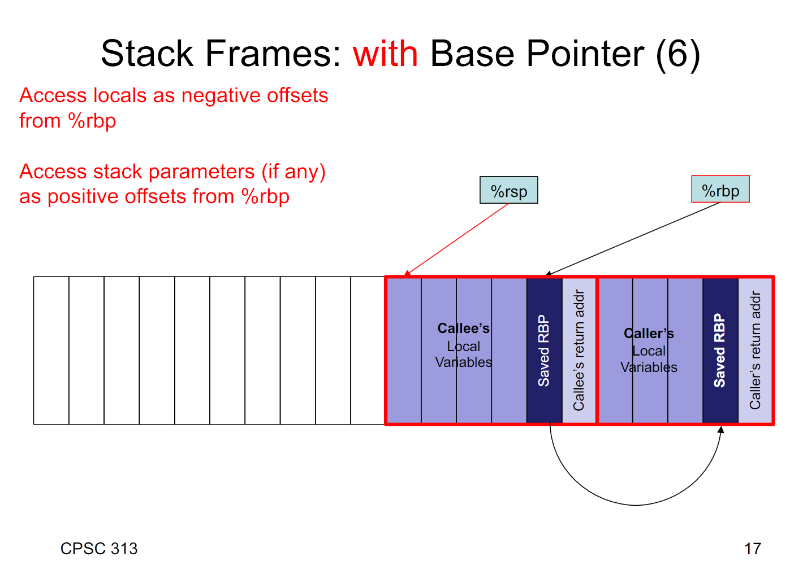

# Y86 Sequential

## Learning Goals

<li>Define what an ISA (instruction set architecture) is and describe the key characteristics of an ISA.</li>

<li>Given the notation from the textbook, describe in plain English and at
a high level what an instruction does.</li>

<li>Given a Y86 instruction and its description convert that to the short
hand form like the following:
<code>R[rB] = R[rA] * R[rB]</code></li>

<li>Given the compiler’s assembly output of a C program map/comment between
the C and assembly.</li>

<li>Explain/Define what is meant by the term "Calling Conventions".</li>
<ul>
<li>Provide an example of a calling convention and compare and contrast
calling conventions.</li>

<li>When given a calling convention write code that conforms to the
calling convention.</li>
<li>Write instructions to set up and teardown a y86 call frame.</li>
</ul>
<li>Given a small piece of C convert it to Y86.</li>

<li>Describe in plain English what a small piece of Y86 is doing.</li>
<li>Explain the purpose and use of the Y86 assembler directives. </li>
<li>Given the description of an instruction format for an ISA, translate between assembly and the machine language byte encoding and vice versa</li>
<li>Enumerate the instruction processing phases of a CPU and the order an instruction goes through them in our Y86 sequential processor</li>
<li>Describe/explain, in plain English, the general functionality of each instruction execution phase</li>
<li>Describe/explain, in plain English, what happens in each phase as an instruction is executed</li>
<li>Use the notation from the text to describe what happens in each phase of the processor as the instruction is executed. Some examples are:</li>
<ul>
<li><strong style="font-weight: bold;">Execute Phase:</strong>&nbsp;valE &lt;-- valB + (-8)</li>
<li><strong style="font-weight: bold;">Memory Phase:</strong>&nbsp;M8[valE] &lt;-- valA</li>
<li><strong style="font-weight: bold;">Write back Phase:</strong>&nbsp;R[%rsp] &lt;-- valE</li>
</ul>
<li>Given a, possibly new, instruction, list the operations that need to be performed at each phase as part of the instruction's execution, or explain why the instruction cannot be executed:
<pre>e.g. valA = R[rA]</pre>
</li>

## Calling coventions
- Parameter passing
- Caller-save registers (e.g. `%rcx`)
    - Functions may do whatever they want to these registers
    - If caller wants to keep the value, it needs to save it to memory before calling
- Callee-save regsiters (e.g. `%rbp`)
    - Functions can rely on these registers not changing
    - If function uses `%rbp`, it will need to save the value and restore it before returning

### Stack frame

