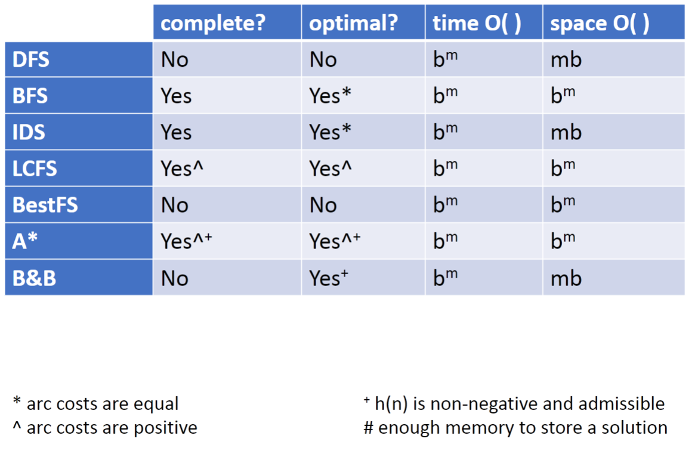

# Search

Learning goals:

- Identify real-world examples that make use of deterministic, goal-driven planning agents
- Assess the size of the search space of a given search problem
- Trace through/implement a generic search algorithm
- Determine basic properties of search algorithms: completeness, optimality, time and space complexity
- Select the most appropriate search algorithms for specific problems
    - BFS vs DFS vs IDS
    - LCFS vs BestFS
    - A* vs B&B
- Construct admissible heuristics
- Verify heuristic dominance
- Combine admissible heuristics
- Justify and describe methods for pruning cycles and repeated states

## Simple planning agent

Consider a deterministic, planning agent. It is initially in a start state and given a goal. The environment only changes when it acts. It also perfectly knows what actions can be taken and the results of these actions. **The sequence of actions** is the solution. 

Examples:

- Delivery robot
- 8-puzzle
- Vacuum cleaner bot

## Search space graph

- Nodes: states
- Edges: actions

## Search procedure

- Start at start state
- Consider effects of different actions
- Stop at goal state

### Graph

- Node (vertice), arc (edge), path
- Cycle
- Directed acyclic graph (DAG)

### Frontier

A collection of paths; TODO list  
The search strategy is defined by how the frontier is expanded

### Branching factors

Forward branching factor is the number of arcs going out of the node; backward branching factor is the number of arcs going into the node.  
If the branching factor of a node is $b$ and the graph is a tree, there are $b^m$ nodes $m$ steps away from the node. 

## Comparing search algorithms

### Complete

If there exists a solution, the algorithm is guaranteed to find a solution within a finite amount of time

### Optimal

An algorithm returns the best solution

### Time complexity

Expressed in terms of maximum path length $m$ and maximum branching factor $b$

### Space complexity

Worst-case amount of memory the algorithm will use in terms of **the number of paths**, also expressed using $m$ and $b$. 

## Uninformed search strategies

### Depth first search

Treats the frontier as a stack; always selects the path most recently added

- Not complete
- Not optimal
- Time complexity $O(b^m)$
- Space complexity $O(mb)$

It is appropriate when memory is limited; not when there are cycles, shallow solutions, or when optimality is important

### Breadth first search

Treats the frontier as a queue; always selects the path first added to the frontier

- Complete
- Optimal (equal edge cost)
- Time complexity $O(b^m)$
- Space complexity $O(b^m)$

Appropriate when space is not limited; opposite of DFS

### Iterative deepening search (IDS)

Use DFS with depth $D=1$; if solution is not found, **start over** with $D+1$

- Complete
- Optimal (equal edge cost)
- Time complexity $O(b^m)$
- Space complexity $O(bm)$

### Lowest-cost-first search (LCFS)

Select a path on the frontier with lowest cost. The frontier is a priority queue ordered by path cost. It is equal to BFS when path costs are equal. 

- Complete (positive path cost)
- Optimal (positive path cost)
- Time complexity $O(b^m)$
- Space complexity $O(b^m)$

## Informed search

Uninformed search doesn't take the nature of the goal into account until reaching the goal node. There is often extra information to guide the search, such as an estimate of the distance from each node to a goal node. This information is called heuristic. 

### Heuristic

A search heuristic $h(n)$ is an estimate of the cost of the lowest-cost path from node n to a goal node. 

A heuristic is **admissible** if it is never an overestimate of the minimum cost from n to a goal. 

$$\forall n, h(n) \leq \text{cost}_{min}(n, goal)$$

#### Construct an admissible heuristic

Start with a relaxed version of the problem. Identify the cost at each state in this simplified problem. E.g. ignoring the walls in a maze. 

#### Dominance

If there are two heuristics $h_1$ and $h_2$, and $h_2(n) \geq h_1(n)$ for every state $n$, then $h_2$ dominates $h_1$. 

#### Combining heuristics

If neither heuristic dominates the other, we can combine them by taking the maximum of the two. 

### Best-first search (BestFS)

Select the path whose end is closest to a goal according to the heuristic function (minimum h value). It treats the frontier as a priority queue ordered by $h$. It is a greedy approach. 

- Not complete (cycle)
- Not optimal (misleading heuristic)
- Time complexity $O(b^m)$
- Space complexity $O(b^m)$

### A*

It combines LCFS and BestFS. Treats the frontier as a priority queue ordered by $f(p) = cost(p) + h(p)$. Selects the path on the frontier with the lowest estimated total cost to a goal. 

- Complete (if costs are positive)
- Optimal (branching factor is finite, costs are positive, and $h(n)$ is admissible and non-negative)
- Time complexity $O(b^m)$
- Space complexity $O(b^m)$

### Branch and bound

A* is bad at space complexity. Branch and bound uses DFS and treats the frontier as a stack. The order in which neighbors are expanded is governed by $f(p)=cost(p)+h(p)$.

B&B keeps a lower bound and upper bound on solution cost at each path:
- Lower bound = $f(p)=cost(p)+h(p)$
- Upper bound = cost of the best solution found so far (start with $\infty$)

When a path is selected for expansion, if $f(p) \geq \text{Upper Bound}$, prune this path without expanding. 

- Complete (no cycles)
- Optimal (not optimally efficient)
- Time complexity $O(b^m)$
- Space complexity $O(bm)$ (big improvement over A*)

## Search summary

## Pruning cycles and repeated states

### Cycle checking

Prune a path that ends in a node already on the path without removing an optimal solution. This usually has linear time in terms of path length. 

### Multiple path

If a new path can reach the same node using a discovered path, and it is more costly, the new path can be pruned. If less costly, remove all paths from the frontier that contains the longer path, or replace the segments of those paths on the frontier with the shorter path. 
