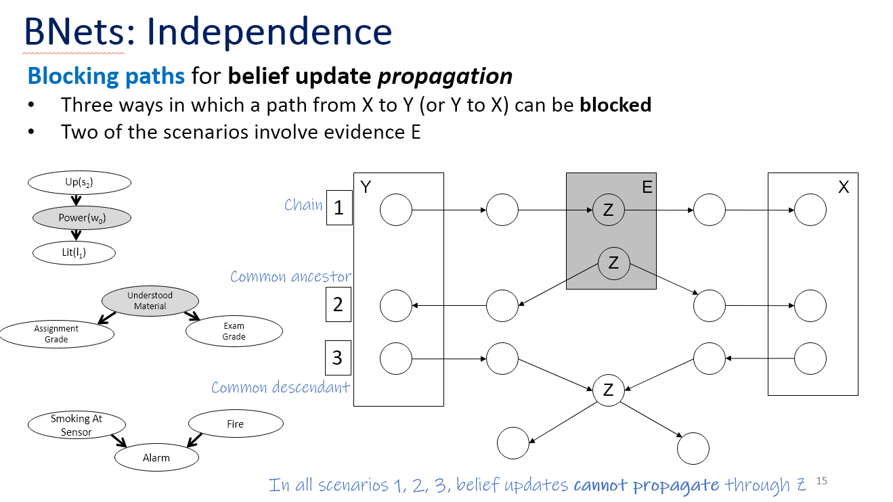
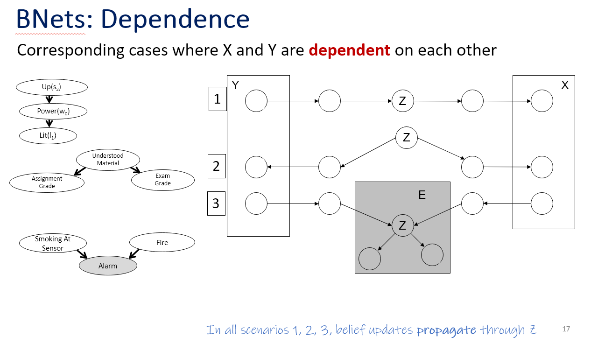

# Uncertainty

## Probability

### Chain rule

$$P(A,B,C)=P(A)\times P(B|A) \times P(C|A,B)$$

### Bayes' rule

$$P(S|H) = \frac{P(H|S)P(S)}{P(H)}$$

### Independence
$X$ and $Y$ are independent iff any of:

$$P(X|Y) = P(X)$$
$$P(Y|X) = P(Y)$$
$$P(X,Y) = P(X)P(Y)$$

### Conditional independence

$X$ is conditionally independent of $Y$ given $Z$ if 

$$P(X|Y,Z)=P(X|Z)$$

## BNet

### Compactness
A JPD requires $O(2^n)$ values to be stored

For $n$ varaibles, if each variable has no more than $k$ parents, the complete network requires $O(n2^k)$ values to be stored. 

### Independence

### Dependence

